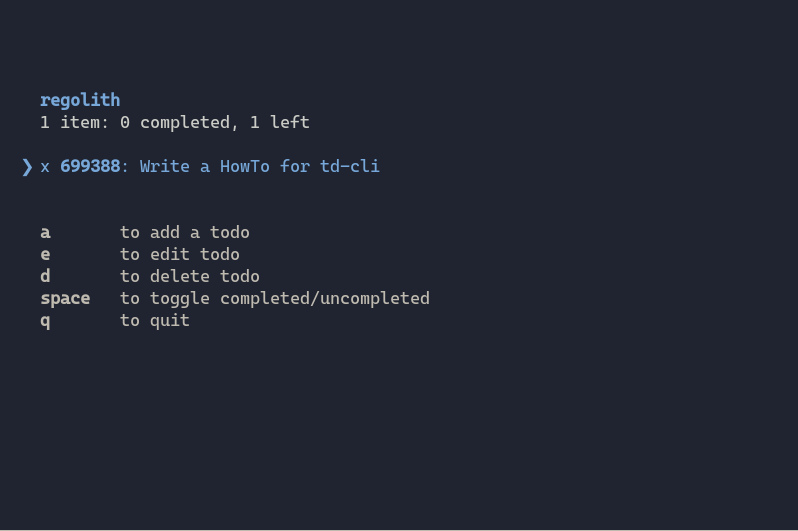

[`td-cli`](https://github.com/darrikonn/td-cli) is a command line todo manager written in Python 3 for organizing your todos across multiple projects.

Regolith, includes a status bar blocklet for accessing `td-cli` directly from the status bar.
This blocklet can be installed as follows:
```bash
sudo apt install i3xrocks-todo
```

After installing `td-cli` you can access it via command line using ``td``. The full documentation of `td-cli`'s API can be found [here](https://github.com/darrikonn/td-cli/blob/master/API.md). For example, let's create a todo list with a group name of Regolith, set it as the default project, and then add a new task to this group:

```bash
td ag regolith
td g regolith p
td a "Write a HowTo for td-cli"
```

Now, if you click on the `td-cli` blocket (on the left of the time blocklet) a floating terminal opens up:




You can add a keybinding for accessing `td-cli`'s floating windows as well. You can add the line following to your `i3` config file, for example, `~/.config/regolith/i3/config`:

```bash
bindsym $mod+Ctrl+d exec --no-startup-id "/usr/bin/gnome-terminal --class=floating_window -e 'td --interactive'"
```

Alternatively, you add these lines to your `i3` config file, first:

```bash
set_from_resource $i3-wm.bindsym.1 i3-wm.bindsym.1 :
set_from_resource $i3-wm.bindsym.program.1 i3-wm.bindsym.program.1 :
bindsym $mod+$i3-wm.bindsym.1 exec --no-startup-id "$i3-wm.bindsym.program.1"
```

Then, add the followings to you `Xresource` file, for example, `~/.config/regolith/Xresources`:

```bash
i3-wm.bindsym.1: Ctrl+d
i3-wm.bindsym.program.1: /usr/bin/gnome-terminal --class=floating_window -e 'td --interactive'
```

